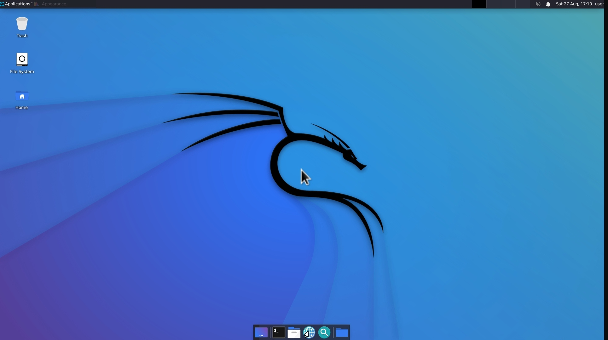

### Docx
* [android-termux-style](https://github.com/harsh7i/Docx/tree/main/termux-style#hello-world-)
  

* [android-kali-gui](https://github.com/harsh7i/Docx/tree/main/android-kali-gui#hello-world-)
  

* [jupyter-notebook-for-android](https://github.com/harsh7i/Docx/tree/main/jupyter-notebook-for-android#hello-world-)
  

* [android-kali-awesome](https://github.com/harsh7i/Docx/tree/main/android-kali-awesome#hello-world-)

  

### Upcoming
* android-ubuntu-gui
* Documentations for python
