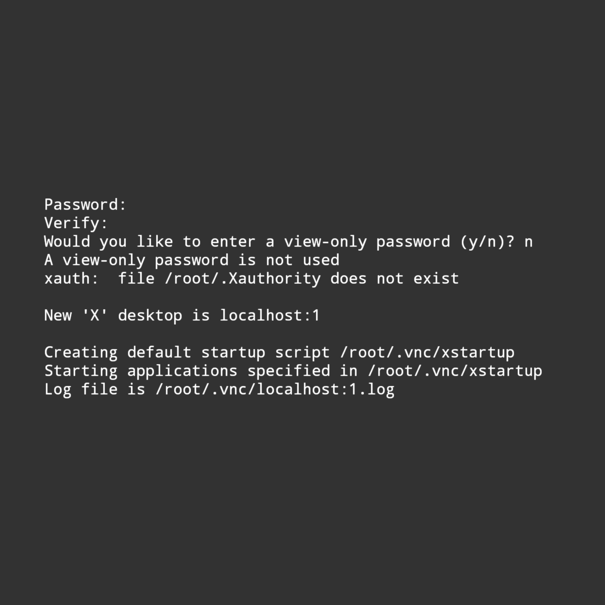

### Hello world !
This is a simple documentation for you.
This documentation helps you to install `xfce4` based `kali linux` gui for your android.
<hr />


#### Upcoming Features
* Reduces app size
* Remove useless apps
* Fast user experience
* Beautiful looking UI

#### Requirements !
* A `kali linux` installed on your terminal emulator.
* Your `kali linux` should be rooted. If you don't have root, use `su` command and then use a `cd` command to go at home directory.
* Minimum 2GB free storage.
* Minimum 512MB of free RAM for better performance.
* Minimum 1GB of Internet.
* Good Internet Connection obviously.
* Free Time

#### Commands !

* Follow These Steps
* Don't use commands manually just copy and paste to save time.

```shell
wget https://raw.githubusercontent.com/harsh7i/Docx/main/android-kali-gui/install-x.sh && chmod +x install-x
```

Now you can execute the script file with `./install-x.sh` or `bash install-x.sh` commamds.

<hr />
It may take too much time.
After sometime it will ask you for Keyboard Layout. <br><br>


Simply `enter` `1` in it and hit the `enter` button.

<hr />

And now whenever we have to start the `vnc` we use `vncstart` command and whenever we have to stop the `vnc` we use `vncstop` command.


If you see this <br><br>
<br>
Use any password what you want,
But in `view-only` password section only use `n` and hit the `enter` button.


I hope you understand how to use vnc viewer app. If not i will make a tutorial for you.

#### Warning !
* Don't use `vncstart` or `vncstop` command twice.
* First use `vncstart` command and then `vncstop`.
* Always use `vncstop` command after using `kali linux` gui.

Otherwise these shortcut commands will not work.