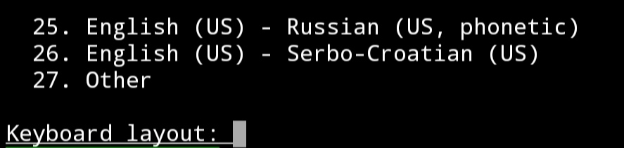

### Hello world !
This is a simple documentation for you.
This documentation helps you to install `xfce4` based `kali linux` gui for your android.

#### Requirements !
* A `kali linux` installed on your terminal emulator.
* Your `kali linux` should be rooted. If you don't have root, use `su` command and then use a `cd` command to go at home directory.
* Minimum 2GB free storage.
* Minimum 512MB of free RAM for better performance.
* Minimum 1GB of Internet.
* Good Internet Connection obviously.
* Free Time

#### Commands !

Follow These Steps

```shell
sudo clear && sudo apt update && sudo apt install tigervnc-standalone-server udisks2 xfce4 tilda dbus-x11 -y
```
<hr />
It may take too much time.
After sometime it will ask you for Keyboard Layout.
<hr />


Simply `enter` `1` in it and hit the `enter` button.

<hr />

* Next Commands

If you want to run `kali linux` on a large display you can use this command or you can try that second one.


* For Large Display

``` shell
sudo rm /var/lib/dpkg/info/udisks2.postinst && sudo echo "" >> /var/lib/dpkg/info/udisks2.postinst && sudo dpkg --configure -a && sudo apt-mark hold udisks2 && curl -OL https://raw.githubusercontent.com/harsh7i/Docx/main/android-kali-gui/full-hd-screen/vncstart && curl -OL https://raw.githubusercontent.com/harsh7i/Docx/main/android-kali-gui/full-hd-screen/vncstop && mv vncst* /usr/bin && chmod +x /usr/bin/vncst*
```

* For Small Display
```shell
sudo rm /var/lib/dpkg/info/udisks2.postinst && sudo echo "" >> /var/lib/dpkg/info/udisks2.postinst && sudo dpkg --configure -a && sudo apt-mark hold udisks2 && curl -OL https://raw.githubusercontent.com/harsh7i/Docx/main/android-kali-gui/hd-screen/vncstart && curl -OL https://raw.githubusercontent.com/harsh7i/Docx/main/android-kali-gui/hd-screen/vncstop && mv vncst* /usr/bin && chmod +x /usr/bin/vncst*
```

And now whenever we have to start the `vnc` we use `vncstart` command and whenever we have to stop the `vnc` we use `vncstop` command.

I hope you understand how to use vnc viewer app. If not i will make a tutorial for you.

#### Warning !
* Don't use `vncstart` or `vncstop` command twice.
* First use `vncstart` command and then `vncstop`.
* Always use `vncstop` command after using `kali linux` gui.

Otherwise these shortcut commands couldn't work.