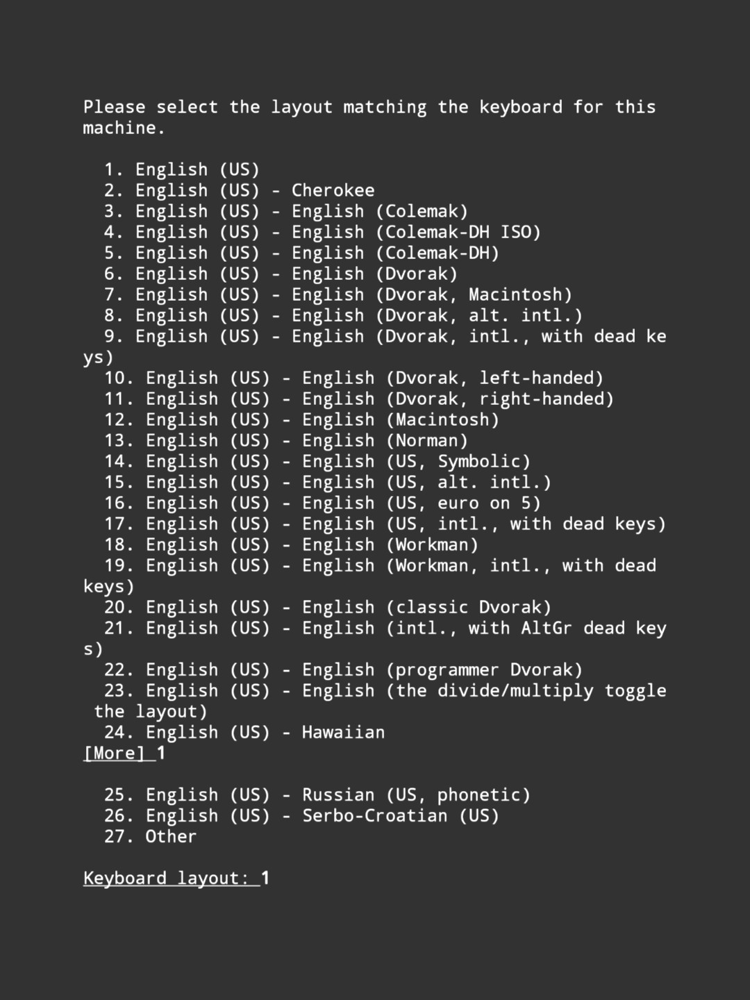

### Hello world !
This is a simple documentation for you.
This documentation helps you to install `xfce4` based ``kali linux`` gui for your android.

#### Requirements !
* A `kali linux` installed on your terminal emulator.
* Your `kali linux` should be rooted. If you don't have root, use `su` command and then use a `cd` command to go at home directory.
* Minimum 2GB free storage.
* Minimum 512MB of free RAM for better performance.
* Minimum 1GB of Internet.
* Good Internet Connection obviously.
* Free Time

#### Commands !
```shell
sudo clear && sudo apt update && sudo apt install tigervnc-standalone-server udisks2 xfce4 tilda dbus-x11 -y
```
<hr />
It may take too much time.
After sometime it will ask you for `keyboard-layout`
<hr />


Simply `enter` `1` in it and hit the `enter` button.