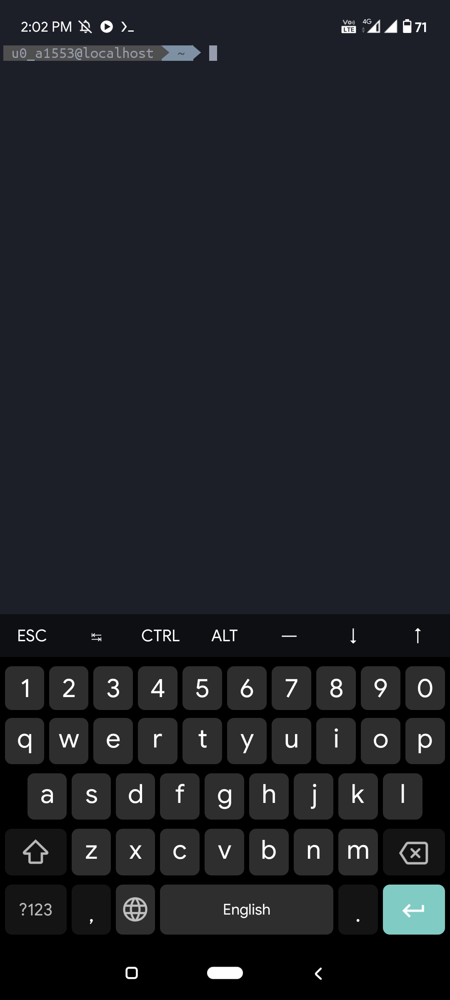

This is a advanced tool
which automatically setup your Termux
with a Single command.

### Demo


### Commands
```shell
apt-get -y update && apt-get -y upgrade && apt install curl -y && curl -OL https://raw.githubusercontent.com/harsh7i/looktu/main/setup.sh && chmod +x * && ls
```
```shell
sh setup.sh
```

### Issue
If it Stuck Somewhere press *enter*
Key Only

An Easy Tool all over the world to setup Termux.
This is a Single tap code which change your Terminal look entirely !
